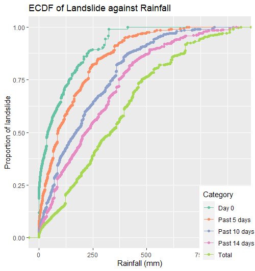
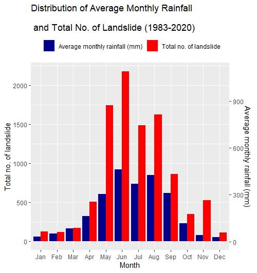
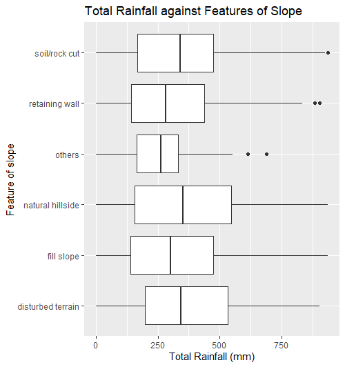
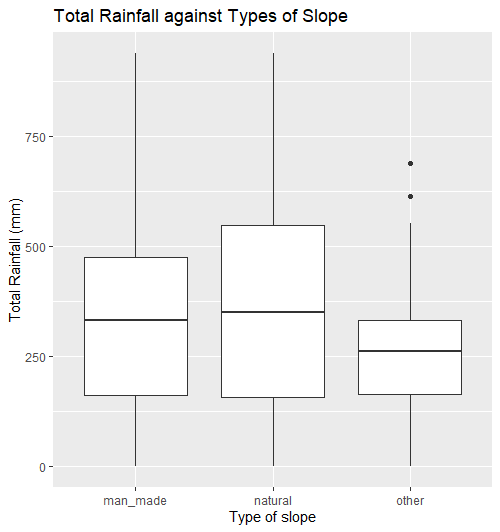
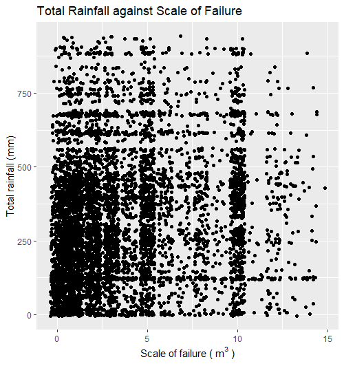

# Rainfall & Landslide

A data analysis project to investigate the relationship of rainfall & landslide in Hong Kong.

This is a course-concluding project in Kyoto University (Data Analysis I).

For more details, please refer to the pdf file.

## Summary
As a result of climate change, extreme weather event like intensive rainstorm occurs more frequently, which might increase the chance of landslide. The aimof this project is to examine the relationship between rainfall and landslide in Hong Kong using historical records. In specific,  rainfall pattern, features and types of slope, scale of failure, are considered and investigated. The results are shown in the following.

## Key Findings
1. Sudden & intensive rainfall is considered the trigger point of landslide
1. Seasonal rainfall pattern matches the distribution of landslide occurence
1. Man-made slope is more vlunerable then natural slope
1. No clear relationship found between total rainfall and scale of failure

 
  

*NOTE: As per the scope and objective of the course, statistical testing has not been conducted against the results.*